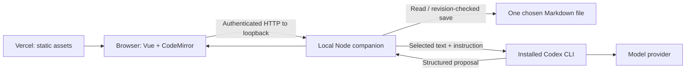

# Foolscap Web POC

A quiet Vue + Vite + CodeMirror writing room that connects a hosted website to a local file and a locally authenticated Codex CLI.

This is a standalone experiment, not a port of the Electron application. The hosted app works immediately as a scratch editor with a clearly labelled, scripted inline-edit demo.

## Run locally

Requires Node 22.13+ and pnpm 10.28.2.

```sh
pnpm install --frozen-lockfile
pnpm dev
```

Open http://127.0.0.1:5197. Select **Preview an inline edit** to review, accept, reject, and undo a scripted suggestion. No model is called in guided-demo mode.

## Use your local Codex and a real file

Install the official Codex CLI and authenticate with `codex login`. This project invokes the installed `codex` binary; it does not collect API keys or copy your credentials into the browser.

Start the companion in another terminal, choosing one Markdown file and the exact website origin:

```sh
pnpm companion --file /absolute/path/to/draft.md --origin http://127.0.0.1:5197
```

For the hosted site, replace the origin with the production URL. Multiple `--origin` arguments are supported. The origin must not have a trailing slash or path.

1. Open the website and click **Connect local agent**.
2. Paste the pairing token printed by the companion. Allow local network access if the browser asks.
3. Click **Open local file**. Only the file chosen in the terminal is available.
4. Select a passage, write an instruction, and click **Suggest an edit** (⌘/Ctrl+Enter).
5. Review the replacement inside the editor. Accept or reject it. Undo restores the original in one action.
6. Click **Save file** (⌘/Ctrl+S). Reopen it to check the saved text.

The token lives only in tab memory; reloading disconnects. Keep the terminal running. Ctrl+C stops the companion. Drafts are not automatically saved: save to the local file or download Markdown before closing the page.

## How it works



Vercel serves the UI. It does not run Codex, receive the document via an application endpoint, or store the companion token. The browser sends the selected text directly to the local companion; Codex sends it to its model provider. “Local agent” means the CLI runs locally, not that model inference is offline.

The companion launches Codex in an empty temporary working directory with a read-only sandbox, ignores user configuration for the run, and requests a structured replacement and reason. It asks the model not to use tools. This is **not** a claim that a prompt disables all agent tools or prevents all local reads. The normal Codex sandbox and authentication still apply. Requests time out after two minutes; cancellation terminates the owned process group. Windows process-tree cleanup has not been qualified.

## Scope and safeguards

- Loopback-only listener; exact website origins and Host validation.
- Random per-run bearer token; no cookies, wildcard CORS, token URLs, or persistent browser credentials.
- Fixed file selected at startup; no browser-supplied paths, executable names, command arguments, or environment variables.
- Validated inputs, bounded files/selections, one active rewrite, and revision-checked saves.
- Writes use a sibling temporary file and rename. External changes detected before saving are rejected. This is not a portable atomic compare-and-swap against another process writing in the tiny final check/rename interval.
- Any document change invalidates an in-flight or displayed proposal; accepted changes use CodeMirror history.
- Download recovery remains available when disconnected or when a disk conflict occurs.

Browser localhost access varies. Start with a current desktop Chromium browser and allow its normal local-network permission. No insecure-browser flags, tunnel, extension, or disabled web security are required by the design. Other browsers and mobile devices are not promised: `localhost` always means the computer running that browser.

This POC intentionally leaves out folder browsing, Git publishing, collaboration, background autosave, installable PWA behavior, and Electron packaging.

## Verification

```sh
pnpm exec playwright install chromium
pnpm verify
```

`verify` runs Oxlint, real-companion Node integration tests, strict typechecks, the Vite production build, and Chromium editor journeys. Browser tests use a **fixture rewrite provider**, not a live model. See [docs/verification.md](docs/verification.md) for separately recorded hosted and live-agent evidence.

## Deploy to Vercel

Import this repository as a Vite project, or run:

```sh
vercel --prod
```

The output is `dist`; the companion remains on your computer. Production headers allow connections only to the same origin and HTTP loopback hosts. Never deploy the companion as a public server. GitHub Actions runs the deterministic verification suite on pushes and pull requests.

## References

- [Codex non-interactive mode](https://learn.chatgpt.com/docs/non-interactive-mode)
- [Chrome local network access](https://developer.chrome.com/blog/local-network-access)
- [Vercel CLI deployment](https://vercel.com/docs/cli/deploy)
