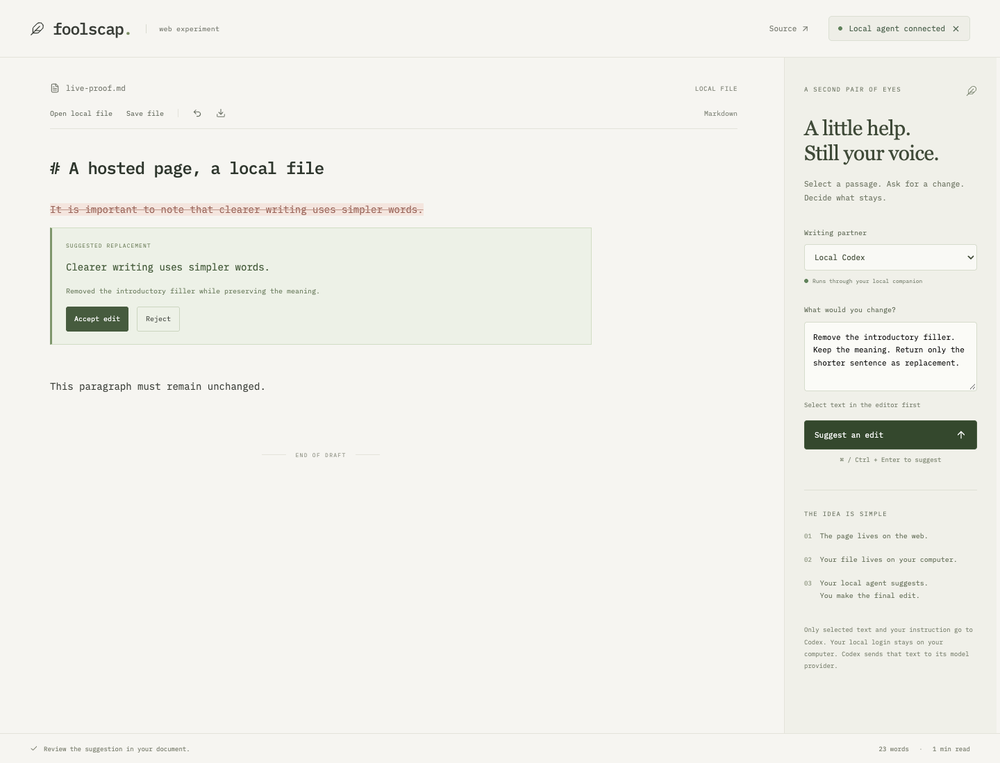

# Verification — 2026-10-03

## Result

**The hosted browser → local file → local Codex → inline review → disk workflow passed.**

Production: https://foolscap-web-poc.vercel.app



## Real hosted and local-agent test

`tests/live/hosted.spec.ts` ran against the production HTTPS URL in installed desktop Chrome on macOS, with a real loopback companion and real installed, authenticated Codex CLI. It did not stub the rewrite response or serve the page from localhost.

The test performed these actions:

1. Paired the hosted page with the companion using a temporary per-run token.
2. Opened `live-proof.md`, a disposable local Markdown file.
3. Selected exactly: “It is important to note that clearer writing uses simpler words.”
4. Asked Codex to remove introductory filler while preserving the meaning.
5. Received: “Clearer writing uses simpler words.”
6. Verified the local file still contained the original while the suggestion was under review.
7. Accepted the inline edit and saved through the browser.
8. Compared the complete disk contents with the expected document, including the unchanged heading and final paragraph.
9. Reopened the local file in the hosted editor and verified the new sentence.
10. Disconnected the browser. The temporary companion was stopped after verification.

The live scenario passed in 6.9 seconds on the first permission-granted run.

### Browser permission qualification

The initial agent-browser session could not connect while Chrome's local-network permission was still `prompt`. The successful isolated Playwright context explicitly granted `local-network-access` for the production origin. This simulates approving the normal permission; it does not demonstrate a user manually clicking the permission prompt. No disabled-web-security flag, HTTPS bypass, tunnel, or extension was used to enable localhost access.

A visitor still needs to run the companion, pair the token, and allow their browser's local-network access. Safari, Firefox, mobile devices, and Windows process cleanup were not qualified.

### Reproduce the live test

From this checkout:

```sh
mkdir -p artifacts/browser
printf '# Live proof\n' > artifacts/live-proof.md
pnpm companion --file "$PWD/artifacts/live-proof.md" --origin https://foolscap-web-poc.vercel.app
```

In another terminal, set `POC_PAIR_TOKEN` to the printed token and run `pnpm test:hosted`. The test overwrites only `artifacts/live-proof.md`, calls the real local Codex CLI, and consumes provider usage. Chrome must be installed. The report and screenshots go to the ignored `artifacts/browser` directory; no token is committed or included in the report.

## Deterministic checks

`pnpm verify` passes:

- Oxlint, formatting, Vue and companion strict TypeScript checks.
- Three Node integration tests using real HTTP and temporary files: save/reopen bytes and stale-save rejection; exact-origin and token checks plus input rejection; proposal-only behavior and cancellation.
- Four Chromium journeys: inline accept/reject/undo; invalidation after typing; paired local-file save/reopen using an explicitly labelled fixture provider; narrow viewport overflow and available controls.
- Production Vite build.

The fixture tests prove application behavior, not provider quality. The live test above proves the additional hosted network and actual agent boundaries. The main JavaScript bundle is approximately 745 KB uncompressed / 258 KB gzip; bundle splitting is left out of this POC.

## Visual inspection

Inspected the hosted desktop editor and the real inline-rewrite screenshot. The narrow layout has an automated 390px viewport overflow check. This is not a full accessibility audit or cross-browser certification.
